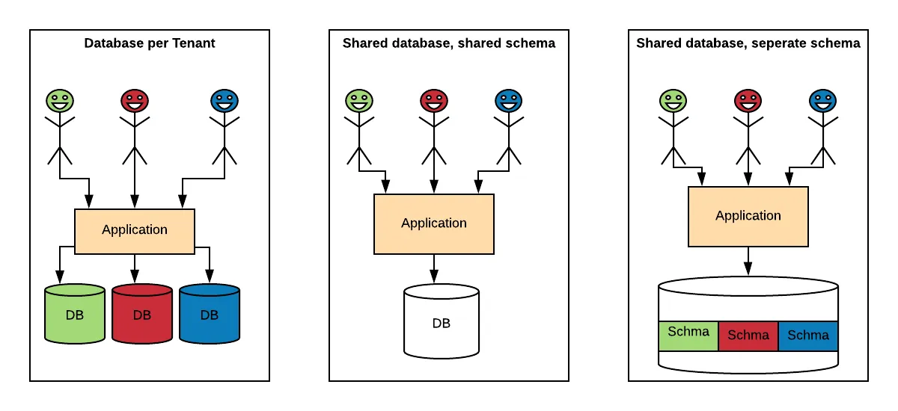

# Dynamic Object Mapping in SQLAlchemy for Multitenancy

In complex applications, it's common to encounter scenarios where multiple tables need to be mapped to the same object. This is particularly useful in a multitenant environment where different tenants may have their own separate tables but require the same functionality and object representation. SQLAlchemy, a popular Python ORM (Object-Relational Mapping) library, provides a flexible way to achieve dynamic object mapping. In this blog post, we'll explore how to implement dynamic object mapping using SQLAlchemy for multitenancy scenarios. 🏢🌐

## Table of Contents

1. [🗺️ Object Mapping and SQLAlchemy Overview](#object-mapping-and-sqlalchemy-overview)
2. [🌀 Dynamic Object Mapping in SQLAlchemy](#dynamic-object-mapping-in-sqlalchemy)
3. [🏢 Handling Multitenancy with Dynamic Object Mapping](#handling-multitenancy-with-dynamic-object-mapping)
4. [⚡ Implementing a Registry Proxy for Optimization](#implementing-a-registry-proxy-for-optimization)
5. [✅ Conclusion](#conclusion)

## 1.🗺️ Object Mapping and SQLAlchemy Overview

Before diving into dynamic object mapping, let's briefly understand the concept of object mapping and the role of SQLAlchemy.

### What is Object Mapping?

Object Mapping is a technique used to bridge the gap between the object-oriented world of programming and the relational world of databases. It allows developers to work with database entities as if they were regular Python objects, abstracting away the underlying database structure and providing a more intuitive and convenient way to interact with data.

### SQLAlchemy: A Python ORM

SQLAlchemy is a powerful and widely used Python ORM that provides a high-level interface for interacting with databases. It simplifies database operations by allowing developers to define database models as Python classes and perform CRUD (Create, Read, Update, Delete) operations using object-oriented syntax.

## 2.🌀 Dynamic Object Mapping in SQLAlchemy

Dynamic object mapping refers to the ability to map different database tables to the same object dynamically at runtime. This is particularly useful when dealing with multitenant applications, where each tenant has its own separate tables but requires the same set of operations and object representation.

In SQLAlchemy, we can achieve dynamic object mapping by dynamically creating classes that represent the database tables. By customizing certain attributes of the class, such as `__tablename__`, `__mapper_args__`, and `__table_args__`, we can ensure that each instance of the class is associated with the appropriate table and that the table definitions can coexist harmoniously.

Let's take a look at an example implementation of dynamic object mapping in SQLAlchemy:

```python
# Define the base class for the object
class DB:
    # Common columns and methods can be defined here

# Define the function to build the object model dynamically
def build_case_model(table_name):
    class Case(DB):
        __tablename__ = table_name
        __mapper_args__ = {'polymorphic_identity': table_name, 'concrete': True}
        __table_args__ = {'extend_existing': True}
        
        # Define the columns specific to the Case object
        # ...

        # Define any additional methods or customizations

    return Case
```

In the above code snippet, we define a function `build_case_model` that takes a `table_name` parameter. This function dynamically creates a class `Case` that inherits from a base class `DB`. The `table_name` parameter is used to set the `__tablename__` attribute of the class, ensuring that each instance of the `Case` class is associated with the corresponding table in the database.


The `__mapper_args__` attribute is used to specify the polymorphic identity of the class, allowing SQLAlchemy to map different tables to the same object. The `polymorphic_identity` argument is set to `table_name`, ensuring that each dynamically created class is correctly associated with its corresponding table.

Additionally, we set the `concrete` argument to `True`, which means that the class is concrete and can be instantiated. This is necessary for dynamic object mapping, as it allows us to create instances of the dynamically generated class.

The `__table_args__` attribute is set to allow extending existing table definitions, ensuring compatibility with other mappings. We use the `extend_existing` argument and set it to `True`, indicating that the table definition should be extended if it already exists. This is useful when multiple mappings are created for the same table, as it allows SQLAlchemy to merge the definitions and avoid conflicts.

Once the `Case` class is dynamically created using the `build_case_model` function, you can use it to perform various operations on the corresponding database table.

## 3.🏢 Handling Multitenancy with Dynamic Object Mapping

<div align="center">
  
</div>

In a multitenant environment with shared databases, where each tenant has its own separate tables either in different schemas or in a shared schema, dynamic object mapping can be leveraged to handle multitenancy efficiently. By dynamically creating classes for each tenant-specific table, we can ensure that the same object representation is used for all tenants while maintaining isolation and data separation.

To handle multitenancy, we can introduce an additional layer called a "Registry Proxy." This proxy acts as a cache and optimization mechanism, storing the dynamically created classes for reuse. Here's an example implementation of a `RegistryProxy` class:

```python
class RegistryProxy:
    __registry_store = {}
    
    @classmethod
    def get_mapped_case_model_for_tenant(cls, tenant_id: int):
        try:
            table_name = f"{tenant_id}_case"
            mapped_instance = cls.__registry_store.get(table_name)
            if mapped_instance:
                return mapped_instance
            mapped_instance = build_case_model(table_name)
            cls.__registry_store[table_name] = mapped_instance
            return mapped_instance
        except Exception as e:
            return None
```

In the `RegistryProxy` class, we maintain a `__registry_store` dictionary as a cache to store the dynamically created classes. When `get_mapped_case_model_for_tenant` is called, the proxy checks if the class for the specified tenant ID exists in the cache. If it does, it returns the cached class; otherwise, it creates a new class using the `build_case_model` function, caches it, and returns the new class.

By utilizing the `RegistryProxy`, we can avoid unnecessary class creation for each tenant and improve performance by reusing the existing dynamically created classes.

## 4.⚡ Implementing a Registry Proxy for Optimization

To optimize the dynamic object mapping process and reduce the overhead of class creation, we introduced the `RegistryProxy`. This proxy acts as a cache for the dynamically created classes, ensuring that the same class is reused for the same table,

 thus improving performance.

Here's the updated `build_case_model` function that incorporates the `RegistryProxy`:

```python
# Import the RegistryProxy class
from registry_proxy import RegistryProxy

# Define the function to build the object model dynamically
def build_case_model(table_name):
    # Get the mapped instance from the RegistryProxy
    mapped_instance = RegistryProxy.get_mapped_case_model_for_tenant(table_name)
    if mapped_instance:
        return mapped_instance
    
    # Create the class dynamically
    class Case(DB):
        __tablename__ = table_name
        __mapper_args__ = {'polymorphic_identity': table_name, 'concrete': True}
        __table_args__ = {'extend_existing': True}
        
        # Define the columns specific to the Case object
        # ...

        # Define any additional methods or customizations

    # Cache the dynamically created class in the RegistryProxy
    RegistryProxy.add_mapped_case_model_for_tenant(table_name, Case)

    return Case
```

In the updated code, we first check if the mapped instance for the given table name exists in the `RegistryProxy`. If it does, we return the cached class. Otherwise, we proceed with the class creation as before, but now we also cache the dynamically created class using the `RegistryProxy`.

By utilizing the `RegistryProxy`, we minimize the overhead of class creation for each tenant, improve performance, and ensure consistency in object representation across tenants.

## 5.✅ Conclusion

Dynamic object mapping is a powerful feature provided by SQLAlchemy that enables developers to map different database tables to the same object dynamically at runtime. This approach is particularly useful in multitenant applications where different tenants require the same functionality and object representation but have their own separate tables.

In this blog post, we explored the concept of dynamic object mapping in SQLAlchemy and its benefits for multitenancy. We saw how to create dynamic classes using the `build_case_model` function and customize attributes like `__tablename__`, `__mapper_args__`, and `__table_args__` to achieve proper object mapping.

Additionally, we discussed the implementation of a `RegistryProxy` for optimization, which acts as a cache for dynamically created classes, reducing overhead and improving performance in multitenant scenarios.

By leveraging dynamic object mapping and the Registry Proxy, developers can efficiently handle multitenancy in complex applications and ensure a flexible and scalable architecture.

I hope this blog post has provided valuable insights into dynamic object mapping in SQLAlchemy for multitenancy scenarios. Happy coding!


