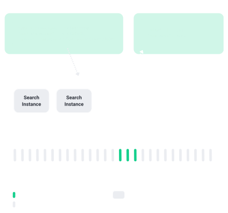

---

## Table of Contents
- [Table of Contents](#table-of-contents)
- [Introduction](#introduction)
- [ElasticSearch Architecture](#elasticsearch-architecture)
- [Quickwit Architecture](#quickwit-architecture)
- [Comparison](#comparison)
- [Conclusion](#conclusion)

## Introduction
In today's data-driven world, finding the right search solution is crucial for businesses to extract actionable insights and unlock the value of their data. Elasticsearch has long been a popular choice for building robust search applications, but now a new contender has emerged: Quickwit. In this blog post, we will delve into a comprehensive comparison of Quickwit and Elasticsearch, exploring their architectures, infrastructure requirements, and the pros and cons of each solution.

## ElasticSearch Architecture

  

In Elasticsearch, documents are stored in segments, which are eventually part of shards. These shards, along with their replicas, are distributed across different physical data nodes in the cluster. Each node in the cluster is responsible for both computation and storage of index data.

The architecture of Elasticsearch can be summarized as follows:
- Documents: Data is stored in the form of documents, which are JSON-based entities containing the actual data to be indexed and searched.
- Segments: Documents are grouped into segments, which are immutable and represent a subset of the index. Segments are stored on disk and provide the basic unit of retrieval in Elasticsearch.
- Shards: Segments are further organized into shards, which are logical units of data containing a subset of the entire index. Each shard is a self-contained index and can be stored on a separate data node.
- Data Nodes: Data nodes are responsible for storing and serving the index data. They handle operations such as indexing, searching, and retrieving data. Each data node typically stores one or more shards, including primary and replica shards.
- Cluster: A cluster consists of multiple data nodes working together as a unified system. The nodes communicate and coordinate with each other to distribute the data, handle failovers, and ensure high availability.

The architecture of Elasticsearch allows for horizontal scalability and fault tolerance. By distributing shards across multiple data nodes, Elasticsearch can handle large amounts of data and provide high-performance search capabilities.

## Quickwit Architecture

  

Quickwit follows a different architecture compared to Elasticsearch, separating storage and computation. It utilizes cheaper storage options such as local file storage or distributed file storage like Amazon S3, reducing the overall cost.

The architecture of Quickwit can be described as follows:
- Index Storage: The index data is stored in a cost-effective storage system, such as local file storage or Amazon S3. This decoupling of storage allows for flexibility and cost optimization.
- Metadata Storage: Quickwit uses a separate metadata storage system, typically leveraging databases like PostgreSQL. Metadata includes information about indexes, schemas, and other relevant details.
- Indexer Nodes: Indexer nodes are responsible for processing and indexing the incoming data. These nodes do not hold the actual data but perform the computation required for indexing.
- Searcher Nodes: Searcher nodes handle search queries and retrieve data from the index storage. Like Indexer nodes, they are stateless and do not store any data.
- Hosting Flexibility: Quickwit can be hosted independently as ECS (Elastic Container Service) services or other container orchestration systems. This allows for scalability and flexibility in managing the compute resources.
- Scaling: Quickwit supports horizontal scaling for Searcher nodes, enabling the addition or removal of nodes as per the workload requirements. This flexibility contributes to the overall scalability of the system.

By separating storage and computation, Quickwit provides a more cost-effective solution while still delivering efficient search capabilities. It is particularly suited for smaller search use cases where lower QPS (queries per second) and acceptable latency are acceptable trade-offs.

## Comparison 
<table>
  <thead>
    <tr>
      <th>Comparison Points</th>
      <th>Elasticsearch</th>
      <th>Quickwit</th>
    </tr>
  </thead>
  <tbody>
    <tr>
      <td>Architecture</td>
      <td>
        In ElasticSearch, documents are stored into segments which are eventually part of shards. These shards (and their replicas) are distributed across different physical data nodes in the cluster. So every node eventually owns some part of data of the index. Nodes are responsible for both computation and storage of index data.
      </td>
      <td>
        Quickwit separates storage and computation. Quickwit uses cheaper options of local file storage or distributed file storage like S3, which reduces the cost. Searcher and Indexer nodes in Quickwit are stateless, which means these nodes do not hold any data; they just perform computation.
      </td>
    </tr>
    <tr>
      <td>Infrastructure</td>
      <td>
        Elasticsearch clusters are complex to self-host as there are multiple nodes involved, and there would be scenarios where adding or removing nodes might lead to redistribution of shards across nodes. We will have to use managed solutions for this.
      </td>
      <td>
        Hosting Quickwit is fairly easy. We can use S3 as index storage and PostgreSQL for metadata storage. Indexer and Searcher nodes can be hosted independently as ECS services. For scaling search queries, we can use multiple searcher nodes and put searcher nodes on autoscaling. Adding and removing searcher nodes is not complex as nodes do not hold any data like ES nodes.
      </td>
    </tr>
    <tr>
      <td>Pros</td>
      <td>
        <ul>
          <li>Data belongs to data nodes (mostly stored in SSD), and hence data can be fetched faster, thus providing low latency over Quickwit.</li>
          <li>Elasticsearch provides update document APIs which are required for our use cases. Documents are by nature immutable, but ES update APIs delete older documents and reindex the new ones.</li>
          <li>Proven solution and can provide high QPS with low latency.</li>
          <li>We can set up Elasticsearch as a managed service on AWS. We might have better support for setting up alerts & monitoring using CloudWatch metrics.</li>
        </ul>
      </td>
      <td>
        <ul>
          <li>Way cheaper than ES as index data is stored in cheaper file storage than storing it at node level.</li>
          <li>Easy scalability of Searcher nodes as searcher nodes are stateless, and while scaling, we don't need to move data around the nodes.</li>
        </ul>
      </td>
    </tr>
    <tr>
      <td>Cons</td>
      <td>
        <ul>
          <li>Very costly solution and might be overkill for smaller search usecases.</li>
          <li>Complex architecture and not easy to self host.</li>
        </ul>
      </td>
      <td>
        <ul>
          <li>As data is fetched from file storage, this is a solution with high latency. It is recommended to use Quickwit for scenarios where QPS would be less than 10 and latency can be between 200ms to 500ms.</li>
          <li>Indexer nodes cannot be scaled horizontally as of now. Might be supported in the future. This becomes a single point of failure. This also hosts API for insertion.</li>
          <li>Not ideal for frequently updated data. There is no update API for documents, and once documents are added, they become immutable. We can delete and reindex the document as well, but that delete API is not yet provided by Quickwit, and as per them, it would be a costly operation.</li>
          <li>No support for fuzzy search.</li>
          <li>Manual management of alerts and monitoring. Need extensive runbooks.</li>
        </ul>
      </td>
    </tr>
  </tbody>
</table>

## Conclusion
Choosing the right search solution depends on your specific requirements, budget, and expected scale. Elasticsearch offers a proven solution with low latency, high QPS, and support for update APIs. However, it can be costly and complex to manage. On the other hand, Quickwit provides a cost-effective and easily scalable option, suitable for smaller use cases. Consider your organization's needs and evaluate the trade-offs outlined in this comparison to make an informed decision about which solution best fits your search requirements.
Happy searching!✨🚀
